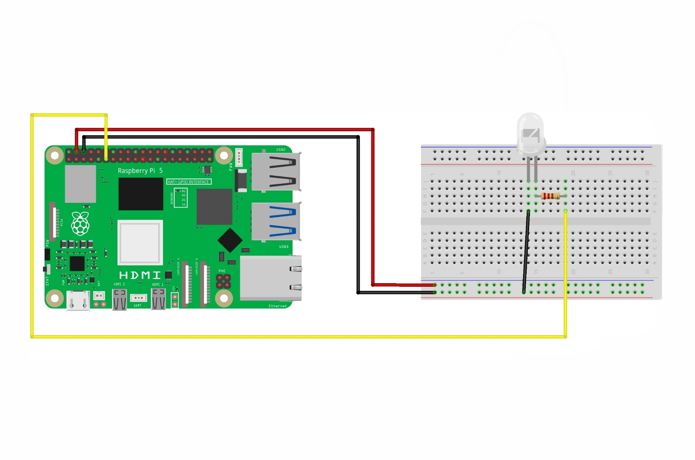

# Blinking LED with Raspberry Pi 5

A beginner-friendly guide to blink an LED using Raspberry Pi 5 and Python.

## Table of Contents
- [Components Required](#components-required)
- [Circuit Diagram](#circuit-diagram)
- [Wiring Instructions](#wiring-instructions)
- [Troubleshooting](#troubleshooting)

## Components Required

- Raspberry Pi 5
- LED (any color, typically 3mm or 5mm)
- 220Ω or 330Ω resistor
- Breadboard
- Jumper wires (male-to-female)
- Power supply for Raspberry Pi 5

## Circuit Diagram



## Wiring Instructions

1. **Identify LED Polarity:**
   - **Anode (+)**: Longer leg, connects to GPIO pin
   - **Cathode (-)**: Shorter leg, connects to ground through resistor

2. **Connect the Circuit:**
   - Insert the LED into the breadboard
   - Connect the LED's anode (longer leg) to GPIO 17 (Pin 11) using a jumper wire
   - Connect the LED's cathode (shorter leg) to one end of the 220Ω resistor
   - Connect the other end of the resistor to a GND pin (Pin 6, 9, 14, 20, 25, 30, 34, or 39)

3. **Raspberry Pi 5 GPIO Pinout Reference:**
   - GPIO 17 is physical pin 11
   - Ground pins are available at multiple locations

## Running the Code

1. Run the script:
   ```bash
   python3 led_blink.py
   ```
2. Stop the program with `Ctrl+C`

## Troubleshooting

### LED Doesn't Light Up

- **Check connections**: Verify all wires are properly connected
- **Check LED polarity**: Ensure anode (+) connects to GPIO and cathode (-) to ground
- **Test LED**: Try connecting LED directly to 3.3V and GND (with resistor) to verify it works
- **Check GPIO pin**: Try a different GPIO pin in case one is damaged

### Permission Errors

```bash
# Add user to gpio group
sudo usermod -a -G gpio $USER

# Or run with sudo (not recommended for regular use)
sudo python3 led_blink.py
```

### ImportError for lgpio

```bash
# Install lgpio for Python 3
sudo apt install python3-lgpio
```


## Safety Tips

1. **Always use a resistor** to limit current through the LED
2. **Don't exceed 16mA** per GPIO pin (max current rating)
3. **Calculate resistor value**:  R = (V_gpio - V_led) / I_led
   - For 3.3V GPIO, typical LED (2V forward voltage, 10mA): R = (3.3-2)/0.01 = 130Ω minimum
4. **Never short GPIO pins** directly to ground or 5V

## Additional Resources

- [Raspberry Pi Official Documentation](https://www.raspberrypi.com/documentation/)
- [GPIO Pinout Reference](https://pinout.xyz/)
- [lgpio Python Documentation](https://abyz.me.uk/lg/py_lgpio.html)
