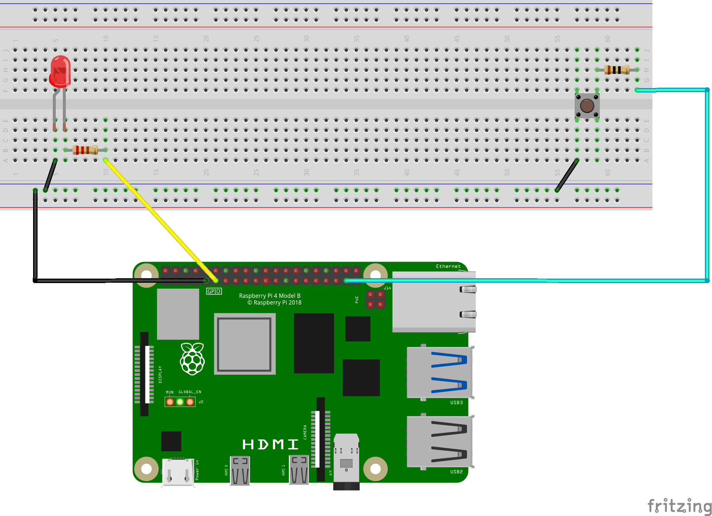

# Raspberry Pi Button-Controlled LED

A simple Raspberry Pi project that demonstrates basic GPIO interaction by controlling an LED with a push button.  

## 📋 Overview

This project uses a Raspberry Pi to control an LED using a push button. When the button is pressed, the LED turns on, and when released, the LED turns off.  The project uses the `gpiozero` library for easy GPIO control.

## 🔧 Hardware Requirements

- Raspberry Pi (any model with GPIO pins)
- 1x LED (any color)
- 1x Push button
- 1x 220Ω resistor (for LED current limiting)
- 1x 10kΩ resistor (for button pull-down - optional, as gpiozero uses internal pull-up)
- Breadboard
- Jumper wires (male-to-male and male-to-female)

## 📐 Circuit Diagram



### Wiring Connections

**LED Circuit:**
- LED anode (long leg) → 220Ω resistor → GPIO 17 (Pin 11)
- LED cathode (short leg) → GND (Ground)

**Button Circuit:**
- One side of button → GPIO 26 (Pin 37)
- Other side of button → GND (Ground)

> **Note:** The `gpiozero` library automatically configures internal pull-up resistors for the button, so the 10kΩ resistor is not needed for this circuit.  You can save it for other projects! 

### Component Details

| Component | Value/Type | Purpose |
|-----------|------------|---------|
| LED Resistor | 220Ω | Current limiting to protect the LED (~9-12mA current) |
| Button Resistor | 10kΩ | Not required (internal pull-up is used) |

> **LED Current Calculation:**  
> With 3. 3V GPIO output, 2V LED forward voltage, and 220Ω resistor:  
> Current = (3.3V - 2V) / 220Ω ≈ 6mA ✅ Safe for most LEDs

## 💻 Software Requirements

### Prerequisites

- Python 3.x
- `gpiozero` library

### Installation

1. Update your Raspberry Pi: 
```bash
sudo apt update && sudo apt upgrade -y
```

2. Install the `gpiozero` library (usually pre-installed on Raspberry Pi OS):
```bash
sudo apt install python3-gpiozero
```

## 🚀 Usage

1. Clone or download the project files to your Raspberry Pi

2. Navigate to the project directory:
```bash
cd /path/to/project
```

3. Run the Python script:
```bash
python3 led_button_control.py
```

4. Press the button to turn the LED on, release to turn it off

5. To stop the program, press `Ctrl+C`


## 🎯 Features

- Real-time button state detection
- Immediate LED response
- Console feedback for debugging
- Clean and simple code structure

## 🔍 Troubleshooting

| Problem | Solution |
|---------|----------|
| LED doesn't turn on | Check wiring connections, ensure 220Ω resistor is connected to LED |
| LED is too dim | Normal with 220Ω resistor - this is safe for the LED |
| Button not responding | Verify button connections and GPIO pin number |
| Permission errors | Run script with `sudo` or add user to `gpio` group |
| Import errors | Ensure `gpiozero` is installed correctly |

## ⚠️ Important Safety Notes

- **Always use the 220Ω resistor with the LED** to prevent burning it out
- The 10kΩ resistor is **not needed** for this project as the code uses internal pull-up resistors
- Never connect an LED directly to GPIO without a current-limiting resistor
- Maximum safe current per GPIO pin is 16mA (this circuit uses ~6mA ✅)

## 🛠️ Future Enhancements

- Add multiple LEDs with different colors
- Implement LED brightness control (PWM)
- Add button debouncing for more reliable detection
- Create toggle functionality (press to turn on, press again to turn off)
- Add timing features (LED blinks, auto-off timer)
- Use the 10kΩ resistor for analog sensor projects

## 📚 Additional Resources

- [gpiozero Documentation](https://gpiozero.readthedocs.io/)
- [Raspberry Pi GPIO Pinout](https://pinout.xyz/)
- [Raspberry Pi Foundation](https://www.raspberrypi.org/)
- [LED Resistor Calculator](https://www.digikey.com/en/resources/conversion-calculators/conversion-calculator-led-series-resistor)

## 📄 License

This project is open-source and available for educational purposes.

## 👤 Author

Created by [Mr-Gholam](https://github.com/Mr-Gholam)

---

**Note**: Always ensure your Raspberry Pi is powered off when connecting or disconnecting components to avoid damage to the GPIO pins. 