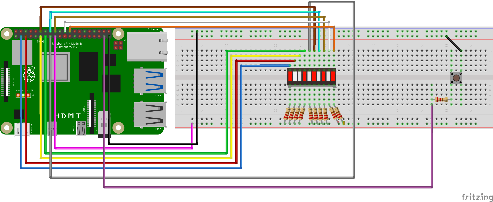

# Raspberry Pi LED Bar Graph with Button Control

A Raspberry Pi project that demonstrates GPIO interaction by controlling a 10-LED bar graph display with a push button.  Each button press lights up the next LED in sequence, creating a visual counter effect.  

## 📋 Overview

This project uses a Raspberry Pi to control a 10-LED bar graph using a push button.  Each button press turns on the next LED in the sequence, keeping previous LEDs lit. After all 10 LEDs are illuminated, the next press resets the display, turning all LEDs off and starting the cycle over.  The project uses the `gpiozero` library for easy GPIO control with built-in debouncing.  

## 🔧 Hardware Requirements

- Raspberry Pi (any model with GPIO pins)
- 10x LEDs (bar graph display or individual LEDs)
- 1x Push button
- 10x 220Ω resistors (for LED current limiting)
- 1x 10kΩ resistor (for button pull-down - optional, as gpiozero uses internal pull-up)
- Breadboard
- Jumper wires (male-to-male and male-to-female)

## 📐 Circuit Diagram



### Wiring Connections

**LED Bar Graph Circuit:**
- LED 1 anode → 220Ω resistor → GPIO 2 (Pin 3)
- LED 2 anode → 220Ω resistor → GPIO 3 (Pin 5)
- LED 3 anode → 220Ω resistor → GPIO 17 (Pin 11)
- LED 4 anode → 220Ω resistor → GPIO 27 (Pin 13)
- LED 5 anode → 220Ω resistor → GPIO 22 (Pin 15)
- LED 6 anode → 220Ω resistor → GPIO 18 (Pin 12)
- LED 7 anode → 220Ω resistor → GPIO 23 (Pin 16)
- LED 8 anode → 220Ω resistor → GPIO 24 (Pin 18)
- LED 9 anode → 220Ω resistor → GPIO 25 (Pin 22)
- LED 10 anode → 220Ω resistor → GPIO 8 (Pin 24)
- All LED cathodes (short legs) → Common GND (Ground)

**Button Circuit:**
- One side of button → GPIO 26 (Pin 37)
- Other side of button → GND (Ground)

> **Note:** The code uses `active_high=False`, indicating a common anode configuration or active-low setup. The `gpiozero` library automatically configures internal pull-up resistors for the button, so the 10kΩ resistor is optional.  

### Component Details

| Component | Value/Type | Quantity | Purpose |
|-----------|------------|----------|---------|
| LED Resistor | 220Ω | 10 | Current limiting to protect each LED (~6mA current) |
| Button Resistor | 10kΩ | 1 | Not required (internal pull-up is used) |
| LED Bar Graph | 10-segment | 1 | Visual display (or use 10 individual LEDs) |
| Push Button | Momentary | 1 | User input control |

> **LED Current Calculation:**  
> With 3. 3V GPIO output, 2V LED forward voltage, and 220Ω resistor:   
> Current = (3.3V - 2V) / 220Ω ≈ 6mA ✅ Safe for most LEDs

## 💻 Software Requirements

### Prerequisites

- Python 3.x
- `gpiozero` library

### Installation

1. Update your Raspberry Pi:  
```bash
sudo apt update && sudo apt upgrade -y
```

2. Install the `gpiozero` library (usually pre-installed on Raspberry Pi OS):
```bash
sudo apt install python3-gpiozero
```

## 🚀 Usage

1. Clone or download the project files to your Raspberry Pi

2. Navigate to the project directory:
```bash
cd /path/to/project
```

3. Run the Python script:
```bash
python3 led_bar_graph.py
```

4. Press the button to light up each LED sequentially (LEDs 1-10)

5. After all 10 LEDs are lit, press the button again to reset and turn all LEDs off

6. To stop the program, press `Ctrl+C`


### How It Works: 

1. **Import Libraries**: Import `LED` and `Button` classes from `gpiozero`, and `pause` from `signal`
2. **Initialize LEDs**: Create a list of 10 LED objects using list comprehension, each with `active_high=False`
3. **Initialize Button**: Create button object on GPIO 26 with 50ms debounce time to prevent false triggers
4. **Define Event Handler**: 
   - `turnLedsOn()` function turns on the next LED in sequence
   - When `ledIndex` reaches 10 (all LEDs lit), it resets to 0 and turns all LEDs off
   - After each press, `ledIndex` increments to track the next LED
5. **Bind Event**:  Attach `turnLedsOn()` to the button press event
6. **Main Loop**: `pause()` keeps the program running and listening for button events

### Key Features: 

- **Event-Driven Architecture**: Uses `when_pressed` event instead of polling
- **Debounce Protection**: `bounce_time=0.05` prevents mechanical button bounce issues
- **Active Low Logic**: `active_high=False` supports common anode LED configurations
- **Sequential Control**:  Tracks position with global `ledIndex` variable
- **Auto-Reset**:  Automatically clears all LEDs after the 10th press

## 🎯 Features

- Event-driven button detection (no polling loops)
- Hardware debouncing with configurable timing
- Sequential LED progression (1→10)
- Automatic reset after full cycle
- Clean and efficient code structure
- Memory-efficient LED management using list comprehension

## 🔍 Troubleshooting

| Problem | Solution |
|---------|----------|
| LEDs don't light up | Check `active_high=False` setting - try `active_high=True` if wired differently |
| LEDs are inverted (on when should be off) | Change `active_high=False` to `active_high=True` |
| Multiple LEDs trigger per press | Increase `bounce_time` value (e.g., `0.1` or `0.2`) |
| Button not responding | Verify button connections to GPIO 26 and GND |
| LEDs stay on after program exit | Normal behavior - run script again or add cleanup code |
| Some LEDs don't work | Check individual LED wiring and resistor connections |
| Permission errors | Run script with `sudo` or add user to `gpio` group |
| Import errors | Ensure `gpiozero` is installed correctly |

## ⚠️ Important Safety Notes

- **Always use 220Ω resistors with each LED** to prevent burning them out
- The 10kΩ resistor is **optional** for this project as the code uses internal pull-up resistors
- Never connect LEDs directly to GPIO without current-limiting resistors
- Maximum safe current per GPIO pin is 16mA (this circuit uses ~6mA per LED ✅)
- Always power off the Raspberry Pi before connecting or disconnecting components

## 🛠️ Future Enhancements

- Add reverse sequence mode (countdown from 10 to 1)
- Implement different animation patterns (chase, blink, fade)
- Add a second button for reset or mode switching
- Create brightness control using PWM
- Add sound effects with a buzzer for each button press
- Implement a timer mode (auto-increment every second)
- Create different display modes (binary counter, random patterns)
- Add RGB LEDs for color-changing effects

## 📚 Additional Resources

- [gpiozero Documentation](https://gpiozero.readthedocs.io/)
- [Raspberry Pi GPIO Pinout](https://pinout.xyz/)
- [Raspberry Pi Foundation](https://www.raspberrypi.org/)
- [LED Resistor Calculator](https://www.digikey.com/en/resources/conversion-calculators/conversion-calculator-led-series-resistor)
- [Button Debouncing Guide](https://gpiozero.readthedocs.io/en/stable/recipes.html#button)

## 📄 License

This project is open-source and available for educational purposes.

## 👤 Author

Created by Mr-Gholam

---

**Note**: Always ensure your Raspberry Pi is powered off when connecting or disconnecting components to avoid damage to the GPIO pins.  