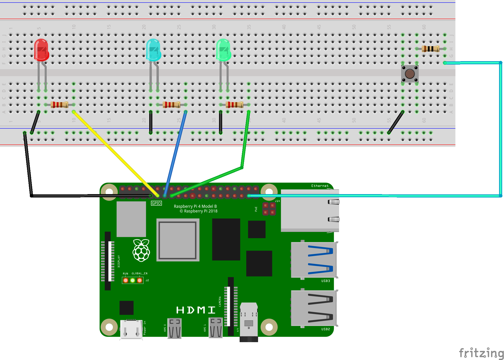

# Raspberry Pi LED Switcher with Push Button

An interactive Raspberry Pi project that cycles through three different colored LEDs using a single push button.  Each button press switches to the next LED in sequence:  Red → Blue → Green → Red. 

## 📋 Overview

This project demonstrates GPIO input/output control and event-driven programming. A push button cycles through three LEDs (red, blue, green) in sequence. The project uses debouncing to prevent false triggers and event-driven programming for efficient execution.

## 🔧 Hardware Requirements

- Raspberry Pi (any model with GPIO pins)
- 1x Red LED
- 1x Blue LED
- 1x Green LED
- 1x Push button
- 3x 220Ω resistors (for LED current limiting)
- Breadboard
- Jumper wires (male-to-male and male-to-female)

## 📐 Circuit Diagram



### Wiring Connections

**LED Circuits:**
- **Red LED:**
  - Anode (long leg) → 220Ω resistor → GPIO 17 (Pin 11)
  - Cathode (short leg) → GND
  
- **Blue LED:**
  - Anode (long leg) → 220Ω resistor → GPIO 27 (Pin 13)
  - Cathode (short leg) → GND
  
- **Green LED:**
  - Anode (long leg) → 220Ω resistor → GPIO 22 (Pin 15)
  - Cathode (short leg) → GND

**Button Circuit:**
- One side of button → GPIO 26 (Pin 37)
- Other side of button → GND

### GPIO Pin Summary

| Component | GPIO Pin | Physical Pin | Function |
|-----------|----------|--------------|----------|
| Red LED | GPIO 17 | Pin 11 | Output |
| Blue LED | GPIO 27 | Pin 13 | Output |
| Green LED | GPIO 22 | Pin 15 | Output |
| Button | GPIO 26 | Pin 37 | Input |
| Ground | GND | Multiple | Common ground |

## 💻 Software Requirements

### Prerequisites

- Python 3.x
- `gpiozero` library

### Installation

1. Update your Raspberry Pi: 
```bash
sudo apt update && sudo apt upgrade -y
```

2. Install the `gpiozero` library (usually pre-installed on Raspberry Pi OS):
```bash
sudo apt install python3-gpiozero
```

## 🚀 Usage

1. Wire up the circuit according to the diagram above

2. Save the code as `led_switcher.py`

3. Run the Python script:
```bash
python3 led_switcher.py
```

4. Press the button to cycle through the LEDs: 
   - 1st press: Red LED turns on
   - 2nd press: Blue LED turns on
   - 3rd press: Green LED turns on
   - 4th press: Back to Red LED (cycle repeats)

5. To stop the program, press `Ctrl+C`


### How It Works: 

1. **Imports**: Import `LED`, `Button` from `gpiozero` and `pause` from `signal`
2. **Button Setup**: Initialize button on GPIO 26 with 50ms debounce time to prevent false triggers
3. **LED Initialization**: Create three LED objects for red, blue, and green LEDs
4. **State Tracking**: Use `ledIndex` variable to track which LED should be active (0=red, 1=blue, 2=green)
5. **Switch Function**:
   - Checks current `ledIndex` value
   - Turns off all LEDs
   - Turns on the appropriate LED
   - Increments index (or resets to 0 after green)
6. **Event Binding**: `when_pressed` attaches the switch function to button press events
7. **Keep Alive**: `pause()` keeps the program running and listening for button events

## 🎯 Features

- ✅ **Event-driven programming** - Efficient, non-blocking code
- ✅ **Button debouncing** - Prevents accidental multiple triggers
- ✅ **Cyclic LED switching** - Smooth rotation through all colors
- ✅ **State management** - Tracks current LED position
- ✅ **Clean shutdown** - Graceful exit with Ctrl+C

## 🔍 Troubleshooting

| Problem | Solution |
|---------|----------|
| LEDs don't light up | Check wiring and ensure all 220Ω resistors are in place |
| Multiple LEDs on at once | Verify GPIO pin numbers match your wiring |
| Button triggers multiple times | Increase `bounce_time` value (e.g., `0.1` for 100ms) |
| Program exits immediately | Ensure `pause()` is called at the end |
| Permission errors | Run with `sudo` or add user to `gpio` group |
| LEDs dim or flickering | Check power supply and resistor values |

## 🎓 Key Concepts Learned

- **Event-driven programming**: Using callbacks instead of loops
- **Debouncing**:  Preventing mechanical switch bounce issues
- **State machines**: Managing multiple states with a single variable
- **GPIO output control**: Controlling multiple devices simultaneously
- **Global variables**: Sharing state across functions

## 🛠️ Future Enhancements

- Add more LEDs for longer sequences
- Implement reverse cycling (hold button for reverse)
- Add PWM for LED brightness control
- Create custom patterns (e.g., blink patterns)
- Add LCD display to show current LED color
- Implement speed control with a potentiometer
- Add sound effects for each LED change
- Create a "Simon Says" memory game

## 💡 Code Improvements

### Alternative:  Using a List for Cleaner Code

```python
from gpiozero import LED, Button
from signal import pause

button = Button(26, bounce_time=0.05)
leds = [LED(17), LED(27), LED(22)]  # Red, Blue, Green
current_led = 0

def switch():
    global current_led
    leds[current_led].off()  # Turn off current LED
    current_led = (current_led + 1) % len(leds)  # Cycle to next
    leds[current_led].on()  # Turn on next LED

# Start with first LED on
leds[0].on()
button.when_pressed = switch
pause()
```

This approach is more scalable if you want to add more LEDs! 

## 📚 Additional Resources

- [gpiozero Documentation](https://gpiozero.readthedocs.io/)
- [gpiozero Button Reference](https://gpiozero.readthedocs.io/en/stable/api_input.html#button)
- [Raspberry Pi GPIO Pinout](https://pinout.xyz/)
- [Debouncing Explained](https://www.arduino.cc/en/Tutorial/Debounce)

## 📄 License

This project is open-source and available for educational purposes.

## 👤 Author

Created by [Mr-Gholam](https://github.com/Mr-Gholam)

---

**Safety Note**: Always power off your Raspberry Pi before modifying the circuit. Ensure all resistors are correctly placed to protect your LEDs and GPIO pins.